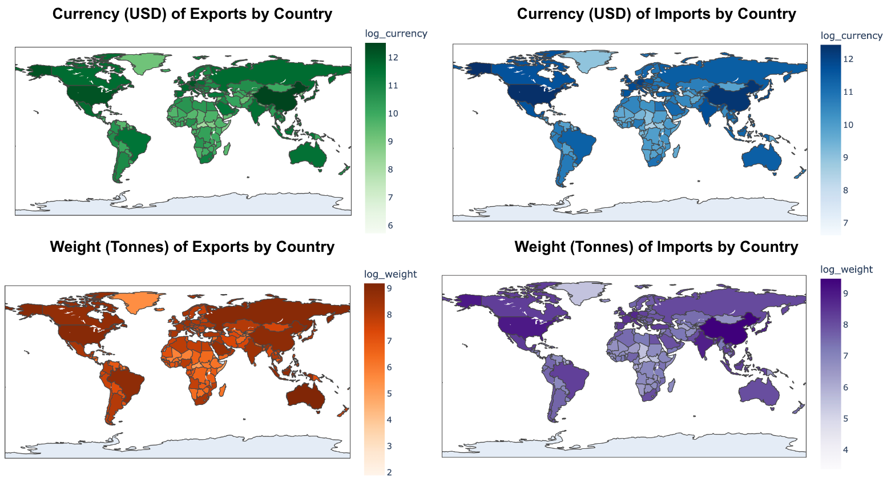

# Comparing Supply Chain Data with UN Global Trade Flows
## Dependencies
A base Conda environment should be sufficient, with the principal Python libraries being `matplotlib`, `numpy`, `scipy`, and `pandas`. For retrieving the Hitachi data, this code should be run on their `JupyterHub` server, interlaced with their remote `AWS ec2` data container and RedShift API.

<figure>
  
    <figcaption><em>Country exports and imports as computed in BACI data.</em></figcaption>
</figure>

## Data 
The Hitachi supply chain data resides on the JupyterLab server. The BACI data (based on UN COMTRADE) is available at <a href = "http://www.cepii.fr/CEPII/en/bdd_modele/bdd_modele_item.asp?id=37">link</a>, with the most recent version HS17. You can either download and unzip all the BACI `.csv` files to the same directory, or run
```zsh
mkdir data
mkdir data/BACI
mkdir data/Hitachi

python retrieve_data.py --baci_dir data/BACI --hitachi_dir data/Hitachi --rs_login <redshift username> <redshift password>
```
to obtain both the most recent Hitachi and BACI data, saved to folders `data/Hitachi` and `data/BACI`, respectively. 

## Command Line Usage
To compare the data (currency amounts and trade weights) in the year 2019 at the HS 6-digit product level, run
```zsh
mkdir images #create a directory to store plots
python compare.py --year 2019 --hs_digits 6 --agg_type product --images_dir images
```
Dataset comparisons are available for years 2019, 2020, 2021, and the recommended HS digit levels are 2,4, and 6 (for ease of product interpretability). You can compare trade values under a different entity combination level by altering the value for`--agg_type`. 

In general, it should take the form `[entity1]_[entity2]_ ...`, where each entity is among <b>[exporter,importer,product]</b> and ordered as such (i.e. `exporter_importer_product` is fine, but not `product_importer`). For instance, `--agg_type importer_product` will calculate an aggregated trade amount (in USD) and weight (in tonnes) for each pair of product and importer country, e.g. fermented black tea in the United States—and compare the metric reported in BACI versus Hitachi.

This will also save out a scatterplot with Hitachi values on the `x`-axis and corresponding BACI values on the `y`-axis. The figure is saved under the directory specified in the Command.

## API Usage
### BACI Dataset
For instance, if one wanted to compute the amount and weight of knitted / crocheted jerseys & cardigans (HS6 code = `611090`) imported by the US (ISO alpha-3 code = `USA`) in `2020` based on BACI,

```python
import read_BACI

country_map, product_map, trade_flow_map = read_BACI.get_BACI_data(data_dir = "./data/BACI", 
                      aggregation_type = "importer_product", year = 2020, hs_level = 6)

importer_country = "USA"
product_code = 611090
print(trade_flow_map[(importer_country, product_code)])

"""output: {'currency': 209638476.0, 'weight': 5654.5960000000005}"""
```

Here, `country_map` maps from country IDs to names, `product_map` maps from HS codes to product descriptions, and `trade_flow_map` maps from entities (e.g. products, importer-product dyads, or exporter-importer-product tuples depending on `aggregation_type`) to amount (US dollar) and weight (tonnes) values. Also, `hs_level` represents how many Harmonized System digits to use for product classification (i.e. the level of product granularity).

```python
print(product_map[product_code])

"""output: Jerseys, pullovers, cardigans, waistcoats and similar articles: 
of textile materials (other than wool or fine animal hair, cotton 
or man-made fibres), knitted or crocheted"""
```

### Hitachi Dataset
For Hitachi, one would run an analagous script, although the `year` is provided differently (since the loader gives data from all years simultaneously). Note that both datasets may have certain products or entities missing.

```python
import read_Hitachi

country_map, product_map, trade_flow_map = read_Hitachi.get_Hitachi_data(data_dir = "./data/Hitachi", 
                   aggregation_type = "exporter_product", hs_level = 6)

#flexible iron or steel tubing
product_code = 830710 
exporter_country = "USA"

trade_flows_2020 = trade_flow_map[2020]
print(trade_flows_2020[(exporter_country,product_code)])

"""output: {'weight': 16.330946196791054, 'currency': 150.03981445684792}"""
```

The above retrieves the values for flexible iron or steel tubing (hs6 code = `830710`) exported by the United States in `2020`. 

# Hitachi Dataset (logistic_data)
This gathers data from transactions in `logistic_data` rather than `index_hs6`, as conducted in the previous section. First, run the following preprocessing script to extract relevant mapping tables. 
```zsh
python  ../register_data/extract_tables.py --dir ./ --rs_login <Redshift username> <Redshift password>
```
This will save out three dictionaries (`./hitachi_{company, country, product}_mappers.json`). Below is a sample script for obtaining aggregated values.
```python
import read_logistic

rs = RedshiftClass(args.rs_login[0], args.rs_login[1])
product_map, trade_flow_map = get_Hitachi_data(rs, "exporter_product", hs_digits = 6, year = 2021, maps_dir = "./")

#exports of refined lead products from the United States 
print(trade_flow_map[('USA', '780110')])

"""output: {'bill_count': 2, 'currency': 90210.9296875, 'quantity': 40742.0, 'weight': 40749.0} """
```
Note this may take slightly longer than the above acquisitions (i.e. with BACI and `index_hs6`).